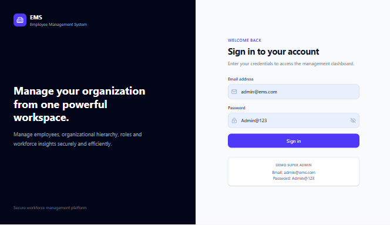
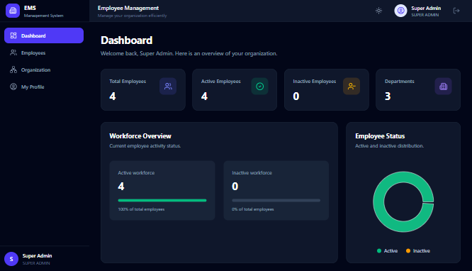
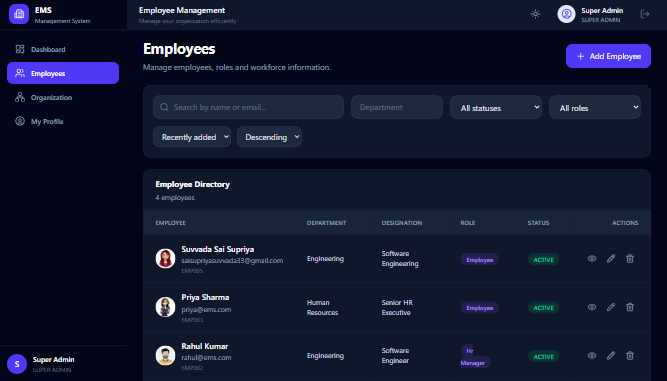
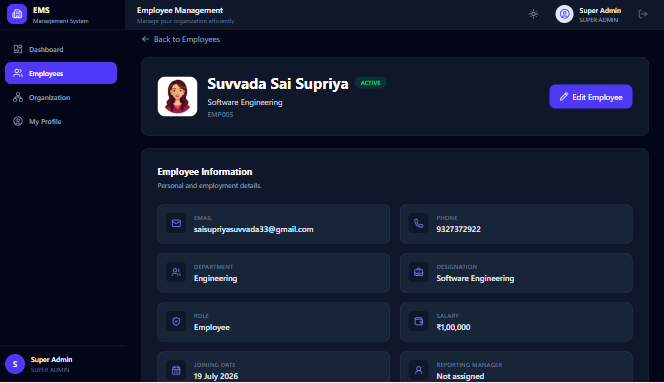
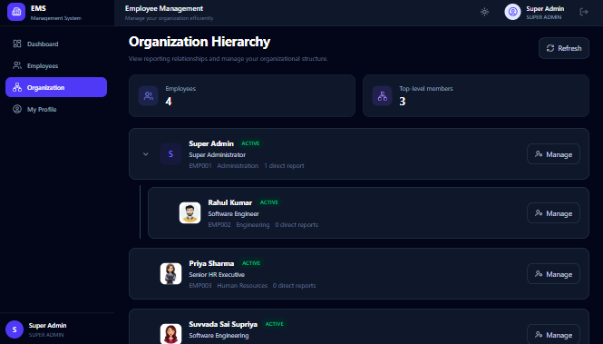
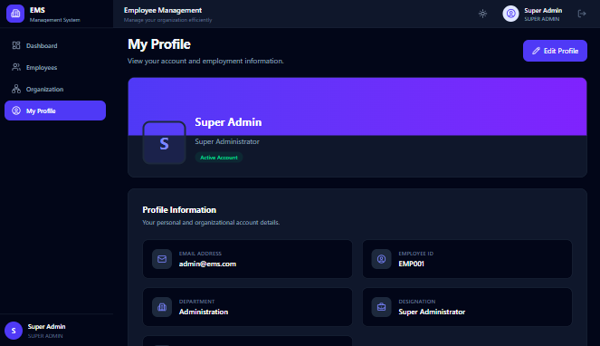

# Employee Management System

A full-stack Employee Management System built using the MERN stack with TypeScript. The application provides secure role-based access for Super Admins, HR Managers, and Employees to manage organizational and employee information efficiently.

## Live Demo

Frontend:
https://employee-management-system-five-chi.vercel.app

Backend API:
https://employee-management-system-gao1.onrender.com

## Features

- Secure user authentication using JWT
- Role-Based Access Control (RBAC)
- Super Admin, HR Manager, and Employee roles
- Employee management
- Add, view, update, and delete employees
- Employee profile management
- Profile image uploads using Cloudinary
- Organization hierarchy visualization
- Dashboard with employee statistics
- Employee status tracking
- Department management
- Search, filtering, sorting, and pagination
- Responsive user interface
- Dark mode support
- Protected frontend and backend routes

## Screenshots

### Login Page

### Dashboard

### Employee Management

### Employee Details

### Organization Hierarchy

### My Profile

## User Roles

### Super Admin

- View organization dashboard
- View all employees
- Add new employees
- Edit employee information
- Delete employees
- View organization hierarchy
- Manage personal profile

### HR Manager

- View organization dashboard
- View and manage employees
- Add and update employee information
- View organization hierarchy
- Manage personal profile

### Employee

- Access personal dashboard
- View personal profile
- Update allowed profile information

## Tech Stack

### Frontend

- React
- TypeScript
- Vite
- Tailwind CSS
- React Router
- Axios
- Recharts
- Lucide React

### Backend

- Node.js
- Express.js
- TypeScript
- MongoDB
- Mongoose
- JWT Authentication
- bcrypt
- Multer
- Cloudinary

### Deployment

- Frontend: Vercel
- Backend: Render
- Database: MongoDB Atlas
- Image Storage: Cloudinary

## Project Structure

    employee-management-system/
    │
    ├── backend/
    │   ├── src/
    │   │   ├── config/
    │   │   ├── controllers/
    │   │   ├── middleware/
    │   │   ├── models/
    │   │   ├── routes/
    │   │   ├── scripts/
    │   │   ├── utils/
    │   │   ├── app.ts
    │   │   └── server.ts
    │   └── package.json
    │
    ├── frontend/
    │   ├── src/
    │   │   ├── api/
    │   │   ├── components/
    │   │   ├── context/
    │   │   ├── pages/
    │   │   ├── types/
    │   │   ├── App.tsx
    │   │   └── main.tsx
    │   └── package.json
    │
    └── README.md

## Getting Started

### 1. Clone the Repository

    git clone https://github.com/saisupriyasuvvada/Employee-Management-System

    cd Employee-Management-System

### 2. Backend Setup

    cd backend
    npm install

Create a `.env` file inside the `backend` directory and configure the required environment variables.

    MONGO_URI=your_mongodb_connection_string
    JWT_SECRET=your_jwt_secret
    CLOUDINARY_CLOUD_NAME=your_cloudinary_cloud_name
    CLOUDINARY_API_KEY=your_cloudinary_api_key
    CLOUDINARY_API_SECRET=your_cloudinary_api_secret
    FRONTEND_URL=http://localhost:5173

Start the backend:

    npm run dev

### 3. Frontend Setup

Open another terminal:

    cd frontend
    npm install

Create the required frontend environment variable:

    VITE_API_URL=http://localhost:5000/api

Start the frontend:

    npm run dev

## Authentication and Authorization

The application uses JWT-based authentication with secure HTTP-only cookies.

Role-based authorization is enforced on both the frontend and backend to ensure users can access only the features permitted for their assigned role.

## Production Deployment

The application is deployed using:

- Vercel for the React frontend
- Render for the Node.js and Express backend
- MongoDB Atlas for the production database
- Cloudinary for cloud-based profile image storage

Production authentication uses secure cross-site cookies and configured CORS policies to enable communication between the deployed frontend and backend.

## Future Improvements

- Password reset functionality
- Email notifications
- Attendance management
- Leave management
- Payroll management
- Advanced analytics
- Audit logs

## Author

**Suvvada Sai Supriya**

Computer Science and Engineering Graduate

## License

This project is developed for educational and portfolio purposes.
